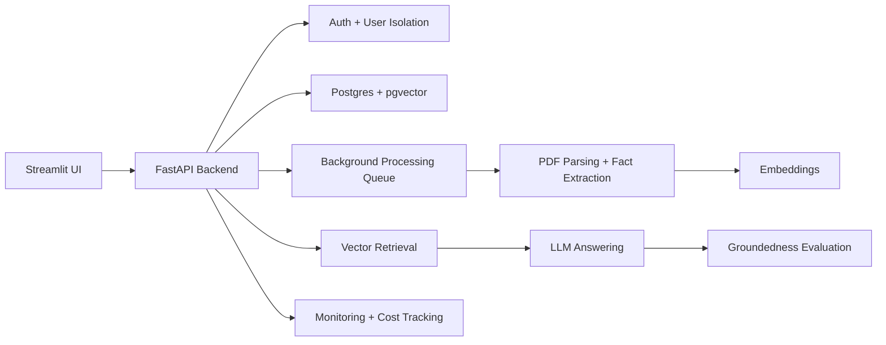

# AskMyDocs

AskMyDocs turns a pile of private PDFs into a searchable, accountable Q&A workspace. It is built for the common “I know this is somewhere in the docs” problem: upload documents, ask questions in plain English, and get answers grounded in retrieved source chunks with hallucination-risk scoring.

The project demonstrates a production-style RAG workflow rather than a notebook demo: multi-user auth, per-user document isolation, background PDF ingestion, vector search with `pgvector`, cost tracking, rate limits, admin monitoring, and separate FastAPI/Streamlit deploy paths.

## Live Demo

- Streamlit app: https://gulshanb01-askmydocs-main-aentas.streamlit.app/

## What It Shows

- End-to-end PDF ingestion: parse uploads, generate document facts, embed chunks, and store them in Postgres.
- Retrieval-augmented chat: retrieve relevant chunks with vector search before generating an answer.
- Trust signals: score groundedness and label hallucination risk for each answer.
- Product readiness: authentication, async processing jobs, usage quotas, cost monitoring, and admin metrics.
- Deployability: Dockerized FastAPI backend, Streamlit frontend, Railway/Postgres deployment notes, and healthchecks.

## Architecture



## Repository Layout

```text
AskMyDocs/
├── backend/
│   ├── main.py                 # FastAPI app and healthcheck
│   ├── db.py                   # Peewee models and database initialization
│   ├── routes/                 # API routers
│   └── services/               # RAG, ingestion, rate-limit, cost, LLM helpers
├── frontend/
│   ├── api_client.py           # Streamlit API client
│   └── auth.py                 # Streamlit auth/session helpers
├── app_pages/                  # Streamlit pages
├── main.py                     # Streamlit entrypoint
├── Dockerfile                  # FastAPI backend image
├── Dockerfile.streamlit        # Streamlit frontend image
├── docker-compose.yml          # Local full-stack runtime
└── railway.json                # Railway backend deployment config
```

## Local Apps

Start the API:

```bash
env/bin/uvicorn backend.main:app --host 127.0.0.1 --port 8000
```

Start Streamlit:

```bash
env/bin/streamlit run main.py --server.port 8505
```

Open:

- Streamlit UI: http://localhost:8505
- Swagger API docs: http://127.0.0.1:8000/docs
- API health check: http://127.0.0.1:8000/health

## Docker Compose

Run the full local stack with Postgres, FastAPI, and Streamlit:

```bash
cp .env.example .env
docker compose up --build
```

Open:

- Streamlit UI: http://localhost:8501
- FastAPI docs: http://127.0.0.1:8000/docs
- API health check: http://127.0.0.1:8000/health
- Postgres: localhost:5433


## API Demo Flow

1. Create an account with `POST /auth/signup`.
2. Copy the returned `access_token`.
3. Click **Authorize** in Swagger and paste the token as the Bearer credential.
4. Test protected endpoints:
   - `GET /documents`
   - `POST /documents/upload`
   - `GET /jobs/{job_id}`
   - `POST /chat/ask`
   - `GET /admin/monitoring`

## Production Features

- Login and user-owned documents/history
- Background PDF ingestion with progress tracking
- RAG retrieval over `pgvector`
- Answer groundedness / hallucination-risk scoring
- Per-user daily rate limiting
- Token and estimated cost tracking
- Admin monitoring dashboard
- Swagger docs for technical API review

## Deployment

The backend is Dockerized and configured for Railway with `railway.json`. The Streamlit frontend can be deployed separately and pointed at the backend API.

Required backend environment variables:

- `DATABASE_URL`
- `GROQ_API_KEY`
- `TOKEN_SECRET_KEY`
- `ACCESS_TOKEN_EXPIRE_MINUTES=1440`
- `LLM_INPUT_PRICE_PER_1M_TOKENS`
- `LLM_OUTPUT_PRICE_PER_1M_TOKENS`

After deployment:

- Backend health check: `https://askmydocs-production-ed37.up.railway.app/health`
- Backend API docs: `https://askmydocs-production-ed37.up.railway.app/docs`
- Frontend app: `https://askmydocs-lzuugs7svivffynzr6uhfv.streamlit.app`

Required frontend environment variable:

- `ASKMYDOCS_API_URL="https://askmydocs-production-ed37.up.railway.app"`

The backend creates the `vector` extension with `CREATE EXTENSION IF NOT EXISTS vector`. If the selected Railway Postgres image does not support pgvector, use a pgvector-capable Postgres provider such as Neon or Supabase for the database URL.
