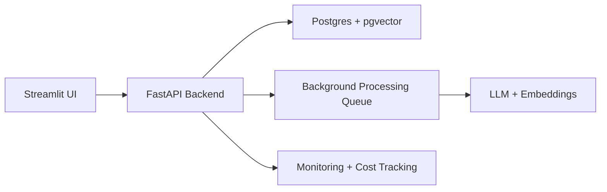

# AskMyDocs

AskMyDocs is a multi-user RAG application for asking questions over private PDF documents. It includes async document processing, per-user data isolation, hallucination-risk scoring, rate limiting, monitoring, and a FastAPI backend with interactive Swagger docs.

## Local Apps

Start the API:

```bash
env/bin/uvicorn backend.main:app --host 127.0.0.1 --port 8000
```

Start Streamlit:

```bash
env/bin/streamlit run main.py --server.port 8505
```

Open:

- Streamlit UI: http://localhost:8505
- Swagger API docs: http://127.0.0.1:8000/docs
- API health check: http://127.0.0.1:8000/health

## Docker Compose

Run the full local stack with Postgres, FastAPI, and Streamlit:

```bash
cp .env.example .env
docker compose up --build
```

Open:

- Streamlit UI: http://localhost:8501
- Swagger API docs: http://127.0.0.1:8000/docs
- Postgres: localhost:5433

## API Demo Flow

1. Create an account with `POST /auth/signup`.
2. Copy the returned `access_token`.
3. Click **Authorize** in Swagger and paste the token as the Bearer credential.
4. Test protected endpoints:
   - `GET /documents`
   - `POST /documents/upload`
   - `GET /jobs/{job_id}`
   - `POST /chat/ask`
   - `GET /admin/monitoring`

## Architecture



## Production-Grade Features

- Login and user-owned documents/history
- Background PDF ingestion with progress tracking
- RAG retrieval over `pgvector`
- Answer groundedness / hallucination-risk scoring
- Per-user daily rate limiting
- Token and estimated cost tracking
- Admin monitoring dashboard
- Swagger docs for technical API review

## Railway Backend Deployment

Deploy the FastAPI backend and Postgres database on Railway:

1. Create a new Railway project.
2. Add a PostgreSQL database service.
3. Add this GitHub repository as a Railway service.
4. Railway will use `railway.json` and `Dockerfile`.
5. Set backend environment variables:
   - `DATABASE_URL` from the Railway Postgres service
   - `GROQ_API_KEY`
   - `TOKEN_SECRET_KEY`
   - `ACCESS_TOKEN_EXPIRE_MINUTES=1440`
   - `LLM_INPUT_PRICE_PER_1M_TOKENS`
   - `LLM_OUTPUT_PRICE_PER_1M_TOKENS`
6. After deploy, verify:
   - `https://<your-railway-api>.up.railway.app/health`
   - `https://<your-railway-api>.up.railway.app/docs`

The backend creates the `vector` extension with `CREATE EXTENSION IF NOT EXISTS vector`. If the selected Railway Postgres image does not support pgvector, use a pgvector-capable Postgres provider such as Neon or Supabase for the database URL.

## Streamlit Cloud Frontend Deployment

Deploy the Streamlit frontend on Streamlit Cloud:

1. Create a new Streamlit Cloud app from this repository.
2. Set the app entrypoint to `main.py`.
3. Add Streamlit secrets or environment variables:
   - `ASKMYDOCS_API_URL="https://<your-railway-api>.up.railway.app"`
4. Deploy and open the Streamlit URL.

The Streamlit app now calls the FastAPI backend for auth, documents, tags, chat, jobs, and admin monitoring. It does not need direct Postgres credentials.
